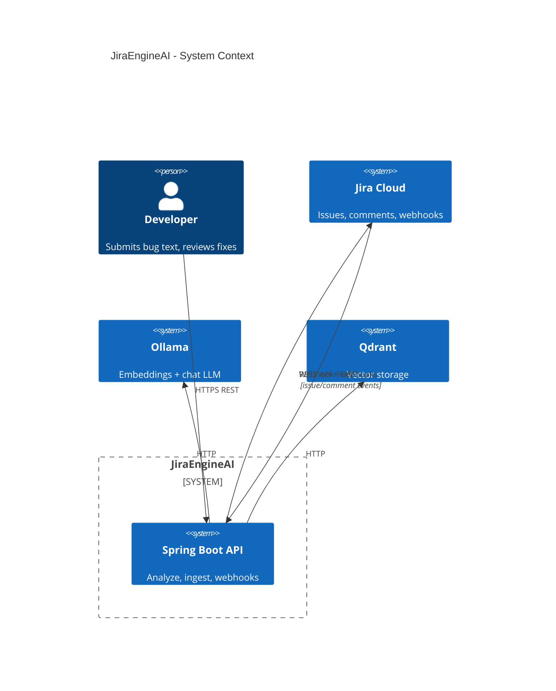
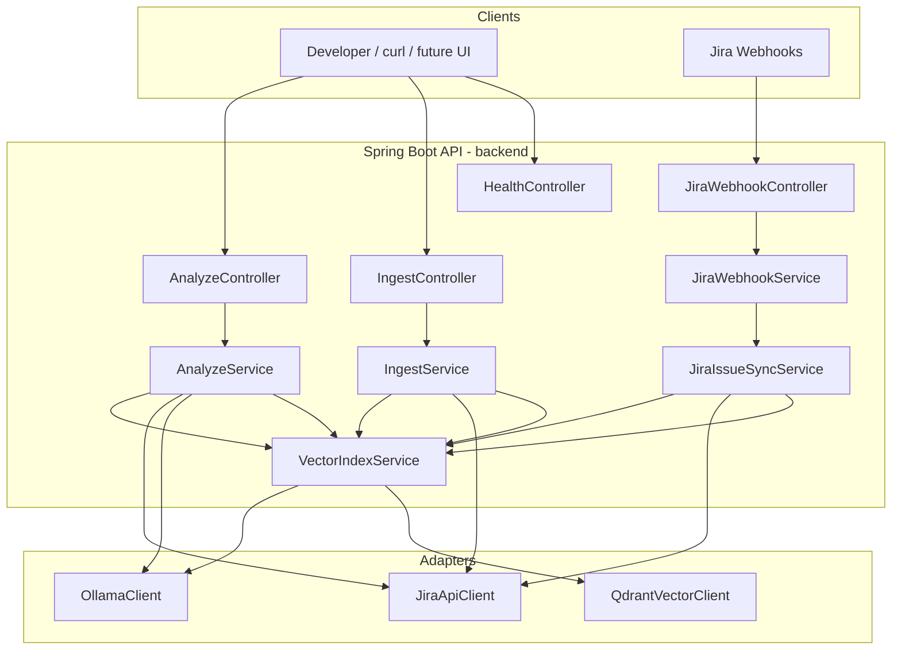
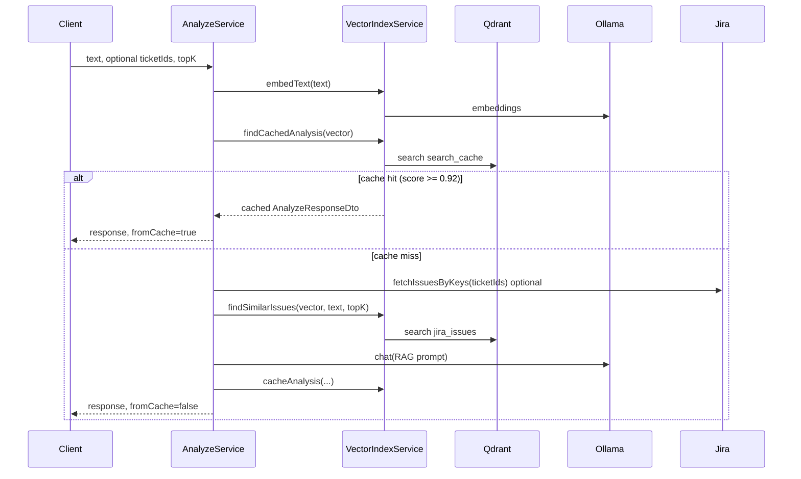
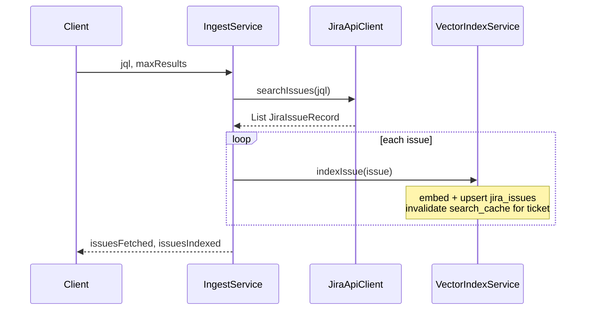
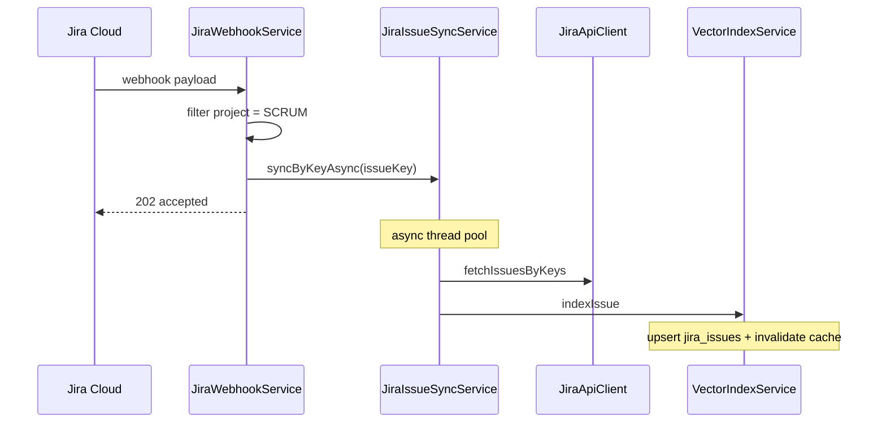

# JiraEngineAI — Design Document

**Version:** 0.0.1-SNAPSHOT  
**Last updated:** May 2026  
**Status:** Backend implemented; frontend planned

---

## 1. Purpose

JiraEngineAI is an **API-first triage assistant** that helps developers debug faster by combining:

- **Live Jira data** (issues, comments, status)
- **Semantic vector search** over historical tickets (Qdrant)
- **Local LLM reasoning** via Ollama (RAG-style prompts)

Users submit plain-text bug descriptions (and optional ticket IDs). The system returns **similar historical issues** and a **structured recommended fix** (root cause, steps, optional code patch).

This is **not** a Jira replacement: the system does **not** create, update, or manage Jira tickets through the analyze API.

---

## 2. Goals and non-goals

### Goals

| ID | Goal |
|----|------|
| G1 | Find semantically similar past Jira issues for a new bug description |
| G2 | Generate actionable fix recommendations using LLM + historical context |
| G3 | Bulk-load historical issues from Jira (JQL ingest) into a vector index |
| G4 | Keep the vector index fresh when SCRUM project issues change (Jira webhooks) |
| G5 | Cache repeat analyze queries for low latency |
| G6 | Invalidate stale analyze cache when referenced tickets are re-indexed |
| G7 | Run fully on local/dev infrastructure (Ollama + Docker Qdrant) |

### Non-goals (current scope)

| ID | Non-goal |
|----|----------|
| NG1 | Jira ticket creation or workflow automation |
| NG2 | Multi-tenant SaaS or billing |
| NG3 | Production JWT/OAuth for API consumers (planned) |
| NG4 | Chunked / multi-vector indexing per ticket (one vector per issue today) |
| NG5 | Web UI (frontend module is a placeholder) |

---

## 3. System context



### External dependencies

| System | Role | Protocol |
|--------|------|----------|
| **Jira Cloud** | Source of truth for issues; webhook publisher | REST API v3, HTTPS webhooks |
| **Ollama** | `nomic-embed-text` (768-dim vectors), chat model for RAG | HTTP (`/api/embeddings`, `/api/chat`) |
| **Qdrant** | Vector database (cosine similarity) | HTTP REST (`:6333`) |

---

## 4. Repository structure (Maven multi-module)

```text
JiraEngineAI/                    # Parent POM (packaging: pom)
├── pom.xml                      # com.jira:jira-engine-ai
├── .mvn/                        # Maven settings (corporate-friendly)
├── docker-compose.yml           # Qdrant
├── DESIGN.md                    # This document
├── backend/                     # com.jira:jira-backend (Spring Boot JAR)
│   └── src/main/java/com/jira/backend/
└── frontend/                    # com.jira:jira-frontend (packaging: pom, planned UI)
    └── pom.xml
```

**Build commands (from repo root):**

```bash
mvn verify              # All modules
mvn -pl backend spring-boot:run   # Run API only
```

---

## 5. High-level architecture



### Layering

| Layer | Responsibility | Examples |
|-------|----------------|----------|
| **Controller** | HTTP mapping, validation, status codes | `AnalyzeController` |
| **Service** | Business orchestration | `AnalyzeService`, `JiraWebhookService` |
| **Port** | Abstractions for testing/swapping | `JiraPort`, `VectorIndexPort`, `OllamaPort` |
| **Client** | External I/O | `JiraApiClient`, `QdrantVectorClient` |
| **Model / DTO** | Domain records and API contracts | `JiraIssueRecord`, `AnalyzeResponseDto` |

---

## 6. Core data stores (Qdrant)

Two collections are used. They are **independent** and serve different purposes.

### 6.1 Collection: `jira_issues`

| Aspect | Detail |
|--------|--------|
| **Purpose** | Semantic search over historical Jira tickets |
| **Granularity** | **One vector per ticket** (full issue text embedded) |
| **Point ID** | Deterministic UUID from `issue:{ticketId}` |
| **Vector** | 768 dimensions, cosine distance |
| **Payload** | `ticketId`, `title`, `description`, `comments`, `status`, `resolution`, `indexableText` |
| **Indexable text** | Ticket + title + status + resolution + description + comments |

**Upsert behavior:** Re-indexing the same ticket **overwrites** the existing point (create or update).

### 6.2 Collection: `search_cache`

| Aspect | Detail |
|--------|--------|
| **Purpose** | Cache full **analyze** responses to skip Ollama on repeat queries |
| **Lookup** | Vector search; best hit must score ≥ `cache-similarity-threshold` (default **0.92**) |
| **Payload** | `normalizedQuery`, `analysisJson`, `referencedTicketIds` |
| **Invalidation** | On `indexIssue()`, delete cache entries referencing that ticket ID |

**Important:** Updating `jira_issues` does **not** automatically refresh `search_cache` unless invalidation runs (implemented via `invalidateCacheForTicket` on re-index).

### 6.3 Cache vs issue index (mental model)

```text
jira_issues     →  "Which tickets are similar to this query?"
search_cache    →  "Did we already answer this exact/similar question?"
```

---

## 7. Key workflows

### 7.1 Analyze (`POST /api/v1/analyze`)



**RAG prompt inputs:**

1. User query text  
2. Live referenced tickets (optional `ticketIds`)  
3. Similar issues from `jira_issues` (title, description, comments, similarity score)

**LLM output schema (JSON):** `rootCauseSummary`, `recommendedFix`, `recommendedCodePatch`, `reproductionSteps`, `relatedTicketIds`

### 7.2 Ingest (`POST /api/v1/ingest`)



### 7.3 Jira webhook sync (`POST /api/v1/jira/webhook`)



**Supported events:** `jira:issue_created`, `jira:issue_updated`, `comment_created`, `comment_updated`

**Configuration:** `JIRA_SYNC_PROJECT_KEY` (default `SCRUM`), optional `JIRA_WEBHOOK_SECRET`

**Discovery:** `GET /api/v1/jira/webhook` returns the webhook URL and setup hints.

---

## 8. API reference

Base URL: `http://localhost:8989` (default `SERVER_PORT`)

| Method | Path | Description | Response |
|--------|------|-------------|----------|
| `GET` | `/api/v1/health` | Liveness | `{ "status": "UP" }` |
| `POST` | `/api/v1/analyze` | Similar issues + AI fix | `200`, `AnalyzeResponseDto` |
| `POST` | `/api/v1/ingest` | Bulk load from Jira JQL | `202`, `IngestResponseDto` |
| `GET` | `/api/v1/jira/webhook` | Webhook URL + setup info | `200`, `JiraWebhookInfoDto` |
| `POST` | `/api/v1/jira/webhook` | Receive Jira events | `202`, `JiraWebhookResponseDto` |

### Analyze request

```json
{
  "text": "401 after OAuth token refresh on login API",
  "ticketIds": ["SCRUM-7"],
  "topK": 5
}
```

### Analyze response (fields)

| Field | Description |
|-------|-------------|
| `similarIssues` | Ranked matches from `jira_issues` |
| `rootCauseSummary` | Plain-language diagnosis |
| `recommendedFix` | Step-by-step fix |
| `recommendedCodePatch` | Suggested code change when applicable |
| `reproductionSteps` | Steps to reproduce |
| `relatedTicketIds` | Ticket keys cited by the LLM |
| `fromCache` | `true` if served from `search_cache` |

---

## 9. Jira integration

### 9.1 Authentication

- **HTTP Basic Auth** with Atlassian API token  
- Env: `JIRA_BASE_URL`, `JIRA_EMAIL`, `JIRA_API_TOKEN`

### 9.2 APIs used

| Operation | Jira REST endpoint |
|-----------|-------------------|
| JQL search | `POST /rest/api/3/search/jql` |
| Bulk fetch | `POST /rest/api/3/issue/bulkfetch` |
| Comments | `GET /rest/api/3/issue/{key}/comment` |

### 9.3 Fields indexed

`summary`, `description`, `status`, `resolution`, and **all comment bodies** (concatenated).

### 9.4 Webhook requirements

- Public **HTTPS** URL (e.g. ngrok in development)  
- JQL filter: `project = SCRUM` (or configured project key)  
- Optional header: `X-Webhook-Secret`

---

## 10. Ollama integration

| Setting | Default | Purpose |
|---------|---------|---------|
| `OLLAMA_BASE_URL` | `http://localhost:11434` | Ollama host |
| `OLLAMA_EMBEDDING_MODEL` | `nomic-embed-text` | 768-dim embeddings |
| `OLLAMA_CHAT_MODEL` | `llama3.2` | RAG / JSON generation |
| `read-timeout-ms` | `120000` | Long-running chat |

**Required models (local):**

```bash
ollama pull nomic-embed-text
ollama pull llama3.2    # or llama3.1 per environment
```

---

## 11. Configuration reference

Defined in `backend/src/main/resources/application.yml` with env overrides.

| Property | Env variable | Default |
|----------|--------------|---------|
| Server port | `SERVER_PORT` | `8989` |
| Public base URL | `APP_PUBLIC_BASE_URL` | (empty; inferred from request) |
| Jira sync project | `JIRA_SYNC_PROJECT_KEY` | `SCRUM` |
| Webhook secret | `JIRA_WEBHOOK_SECRET` | (empty = no auth) |
| Qdrant URL | `QDRANT_BASE_URL` | `http://localhost:6333` |
| Cache threshold | `QDRANT_CACHE_THRESHOLD` | `0.92` |
| Issue similarity threshold | `QDRANT_ISSUE_THRESHOLD` | `0.55` |
| Default top-K | (in yaml) | `5` |

---

## 12. Error handling

`GlobalExceptionHandler` returns consistent JSON (`ApiErrorResponse`):

| Exception | HTTP status |
|-----------|-------------|
| `BadRequestException` | 400 |
| `UnauthorizedException` | 401 (webhook secret) |
| `JiraIntegrationException` | 502 |
| `AiServiceException` | 503 |
| Validation errors | 400 with field map |

Caching failures are **swallowed** so analyze never fails solely due to cache write errors.

---

## 13. Security (current and planned)

### Current (development)

- API is **open** on localhost (no JWT)  
- Jira credentials in `.env` (gitignored)  
- Optional webhook secret validation  

### Planned (production)

| Item | Approach |
|------|----------|
| API auth | JWT or API keys on `/analyze`, `/ingest` |
| Webhook | Mandatory secret + HTTPS only |
| Secrets | Vault / CI secrets, never commit tokens |

---

## 14. Deployment topology (local)

```text
┌─────────────────┐     ┌──────────────────┐
│  Spring Boot    │────▶│  Qdrant :6333    │
│  :8989          │     │  (docker compose)│
└────────┬────────┘     └──────────────────┘
         │
         ├──────────────────▶ Ollama :11434 (host)
         │
         ├──────────────────▶ Jira Cloud (HTTPS)
         │
         └◀─────────────────  Jira Webhooks (HTTPS inbound)
```

**Startup order:**

1. `docker compose up -d` (Qdrant)  
2. Start Ollama with required models  
3. Configure `.env` from `.env.example`  
4. `mvn -pl backend spring-boot:run`  
5. `POST /api/v1/ingest` (initial load)  
6. Register Jira webhook → `GET /api/v1/jira/webhook` for URL  

---

## 15. Testing strategy

| Type | Location | Focus |
|------|----------|-------|
| Unit | `*ServiceTest`, `JiraApiClientTest` | Analyze logic, cache invalidation, webhook filtering |
| Web slice | `*ControllerTest` (MockMvc) | HTTP contracts, status codes |
| Integration | Manual / future | End-to-end with Qdrant + Ollama |

```bash
mvn -pl backend test
```

---

## 16. Similarity and ranking

### Issue search (`jira_issues`)

1. Vector search in Qdrant (cosine score)  
2. Filter by `issue-similarity-threshold` (default 0.55); if none pass, return top-1 anyway  
3. **Text fallback:** token overlap over scrolled issues if vector search returns empty  

### Analyze cache (`search_cache`)

- Top-1 vector match; require score ≥ **0.92**  
- Reject “weak” cached results (no similar issues and no meaningful fix)  

---

## 17. Known limitations

| Limitation | Impact | Possible future fix |
|------------|--------|---------------------|
| One vector per ticket | Very long issues may dilute embedding quality | Chunking + multi-point index |
| Semantic cache can be stale | Rare: cache hit without ticket in `referencedTicketIds` | TTL or global cache flush on any sync |
| No delete on Jira issue deleted | Orphan vector in `jira_issues` | Webhook `jira:issue_deleted` handler |
| Open API | Not production-safe | JWT layer |
| Frontend empty | CLI/curl only | React/Vue module + `frontend-maven-plugin` |
| Sync webhook async | Brief lag after Jira edit | Acceptable; monitor thread pool |

---

## 18. Roadmap

| Priority | Item |
|----------|------|
| P1 | Web UI (`frontend` module) |
| P1 | JWT authentication |
| P2 | Issue delete handling in Qdrant |
| P2 | Cache TTL / metrics (Prometheus) |
| P3 | Multi-project webhook filters |
| P3 | Chunked indexing for large descriptions |

---

## 19. Glossary

| Term | Meaning |
|------|---------|
| **RAG** | Retrieval-Augmented Generation — LLM prompt enriched with retrieved tickets |
| **Upsert** | Insert or update vector point by ID |
| **JQL** | Jira Query Language for ingest filters |
| **topK** | Number of similar issues returned |
| **fromCache** | Analyze response served from `search_cache`, not recomputed |

---

## 20. Document history

| Date | Change |
|------|--------|
| May 2026 | Initial design doc: multi-module Maven, webhooks, cache invalidation, API reference |
